# 以下内容为科普性的内容，可选择性跳过

# Roll,Pitch & Yaw

roll、pitch、yaw分别代表横滚、俯仰和偏航，下图是这三个姿态角的直观展现

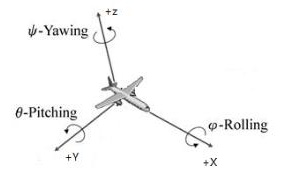

# 硬件

## **飞控/飞行控制器/自动驾驶仪/Autopilot**

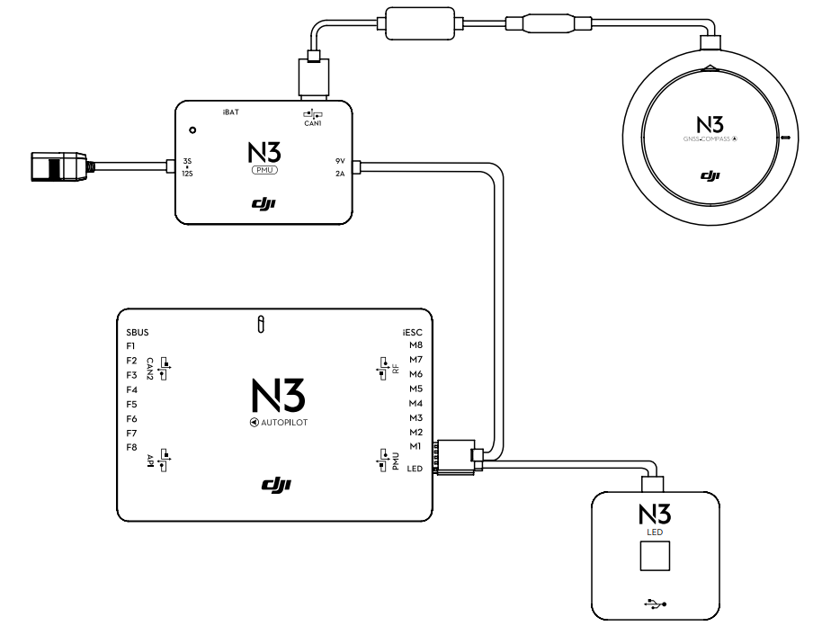

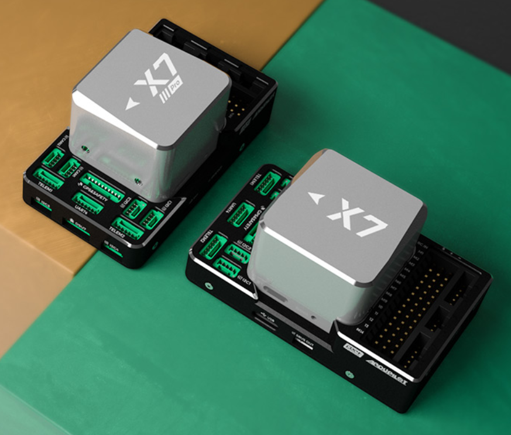

飞控是无人机的控制中心，它内部的芯片一般是stm32等MCU，其中运行的飞控程序负责测量估计无人机的姿态并计算四个电机的输出。一般来说，飞控硬件包含主控、电源管理模块/PMU、状态指示灯、安全开关（可选项）、GPS（可选项）

## **遥控器&接收机**

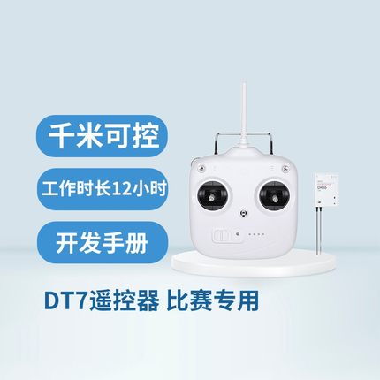

关于遥控器通道，有美国手：

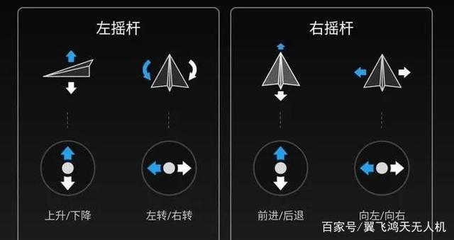

日本手：

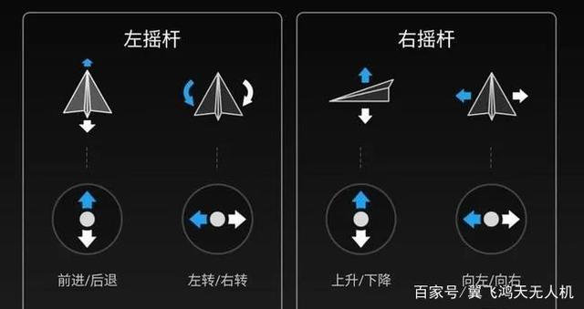

中国手：

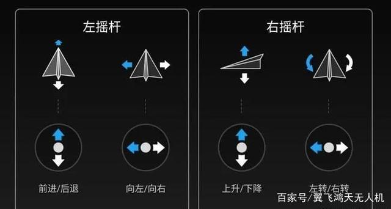

遥控器将飞手的操作发送到接收机，接收机再将飞手的控制信号以一些格式输入到飞控，这种控制信号称为接收机的协议，接收机协议有PWM、PPM、?BUS几种

**PWM**

顾名思义，这种方式就是把每个输入通道直接以PWM信号的形式输出（因此通道越多需要接的线越多），不了解PWM的可以自行百度。这种控制方式常见于固定翼飞机等直接直接将遥控器输入对应到舵机和电调输出的场合。

**PPM**

PPM协议将PWM的几个通道整合到一条线传输，PPM协议似乎不太常用而且笔者也没用过故不作展开，有兴趣者可自行了解（

**?BUS**

?BUS表示的是SBUS、DBUS、IBUS、XBUS等协议，因为它们十分相似所以我把他们归类到一块。

?BUS都是基于串口通信的协议（不知道什么是串口通信的请自行搜索UART & Serial)，最早是日本的Futaba公司（一个在无线电领域很NB的公司）开发出了这种通信协议，后来其他遥控器厂商也开始使用这种协议，有些公司魔改了其中的部分内容（比如改波特率、把串口反电平改成正电平、改字节数等）就得到了各种各样的BUS，比如DJI的DBUS

DJI的飞控和PIXHAWK等飞控使用的都是SBUS协议，而DJI的DT7/DR16遥控套件默认使用的是DBUS协议，所以在将DT7/DR16用于无人机飞控之前需要先将其寄回DJI刷固件。

关于遥控器协议的更详细内容可以在下面的链接中查看：

[一文打尽PWM协议、PPM协议、PCM协议、SBUS协议、XBUS协议、DSM协议 | STM32实现PPM](https://www.bilibili.com/read/cv8758980/?ivk_sa=1024320u)

## **螺旋桨、电机&电调**

观察下图中的直升机，它除了在上方有一个大螺旋桨外，在尾部还有一个小螺旋桨，这个小螺旋桨是用来抵消大螺旋桨在yaw轴方向上对机身施加的扭矩的，如果去掉这个小螺旋桨，直升机的机身将会在螺旋桨旋转的同时向相反的方向旋转。

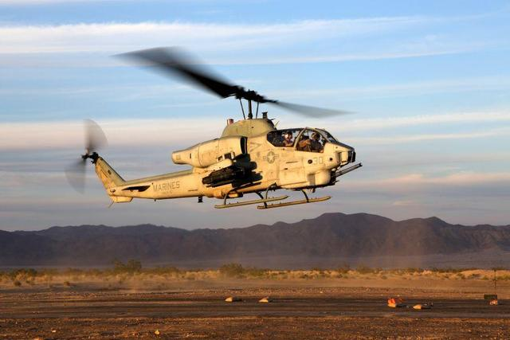

下图是共轴反桨直升机，顾名思义，它通过增加一个反向旋转的大螺旋桨来抵消扭力。

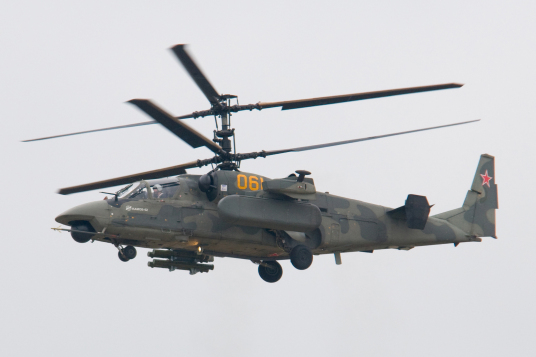

同理，在四旋翼无人机上，四个螺旋桨旋转的方向不是相同的，如图，对侧的两个螺旋桨的转向相同而相邻的螺旋桨转向相反，因此要使四个螺旋桨都提供升力就必须有两种螺旋桨（参考正着装扇叶和反着装扇叶的两台电风扇），要使无人机在yaw轴上旋转，比如向左转，下图中无人机的1、2号螺旋桨转速就应该降低，此时3、4对机身施加的向左转的力矩将大于1、2对机身施加的向右转的力矩，从而使飞机自旋

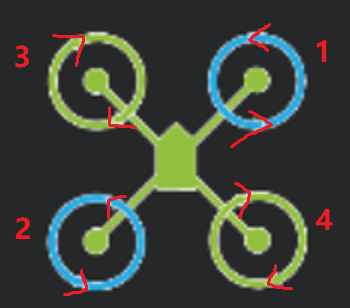

下面只讨论直流无刷电机

和两极一接电就能转的有刷电机不同，无刷电机是采用三相供电的，因此需要驱动器也就是电调才能工作，无刷电机通过向定子线圈输入交变的电压来产生旋转磁场从而使转子旋转，因此在电调输出不变的情况下任意调换三相中的两相就能让电机反转。航模使用的电调一般采用PWM信号输入，通过占空比来调速，电机旋转方向固定（毕竟你绝对不会希望你的飞机在半空中因为硬件或者软件问题让电机反转然后炸机，这是比电机停转还可怕的事情）。因此电机的安装是非常重要的事情，不少新手就是因为电机装错了或者桨装错了导致起飞即炸机（翻了）。

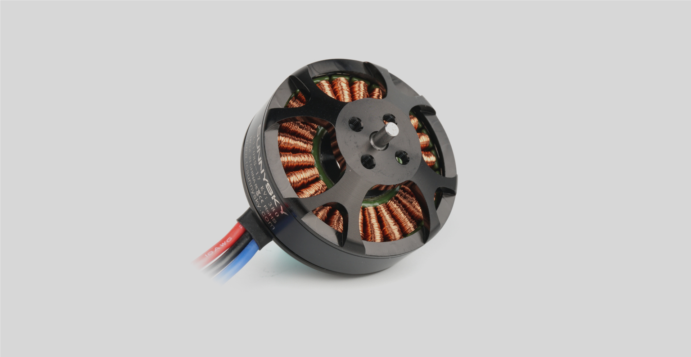

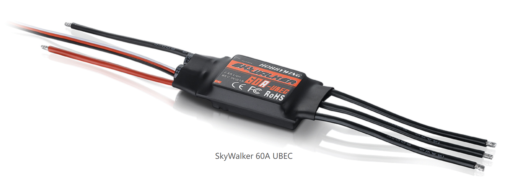

有些电机（比如农用机上的大电机）的电调是和电机整合到一块的，RM的无人机用的电机也是这种。

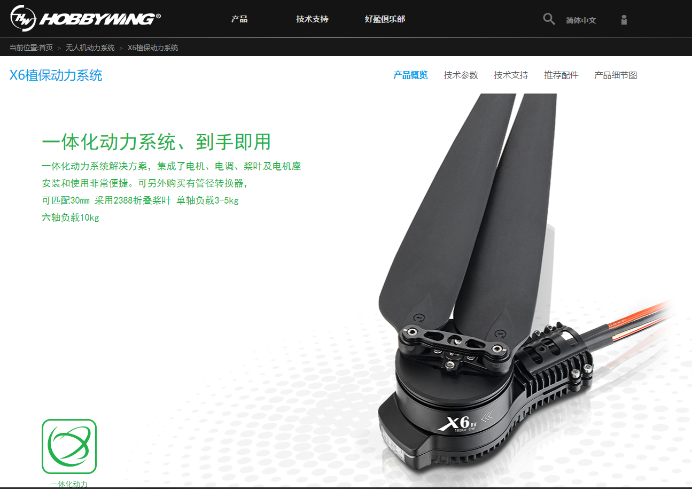

# 软件
